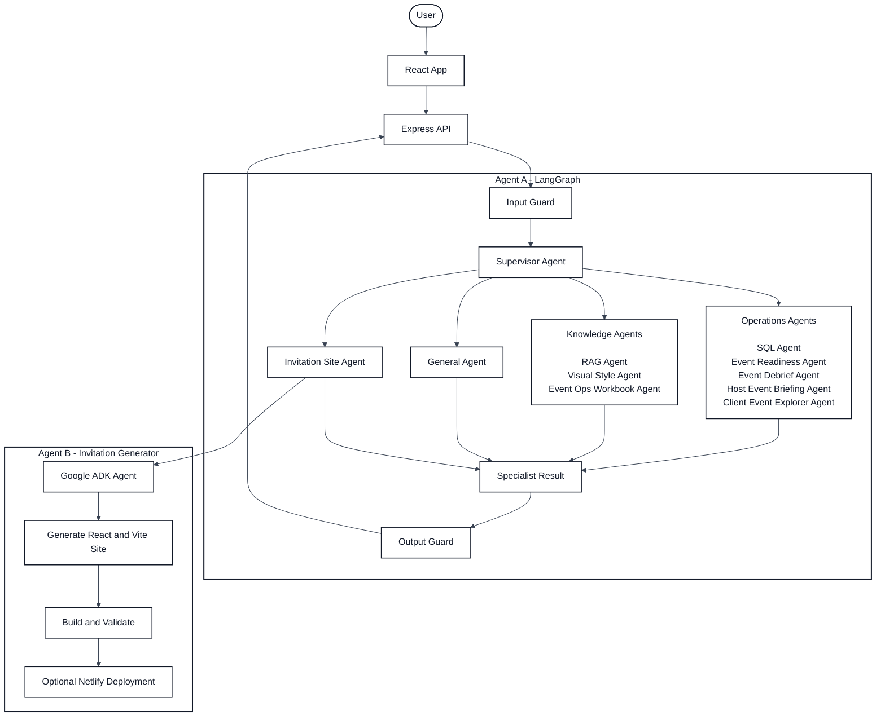
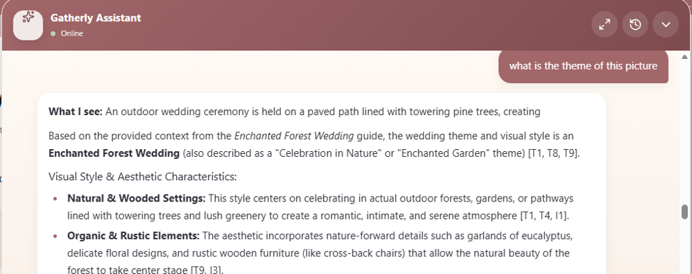
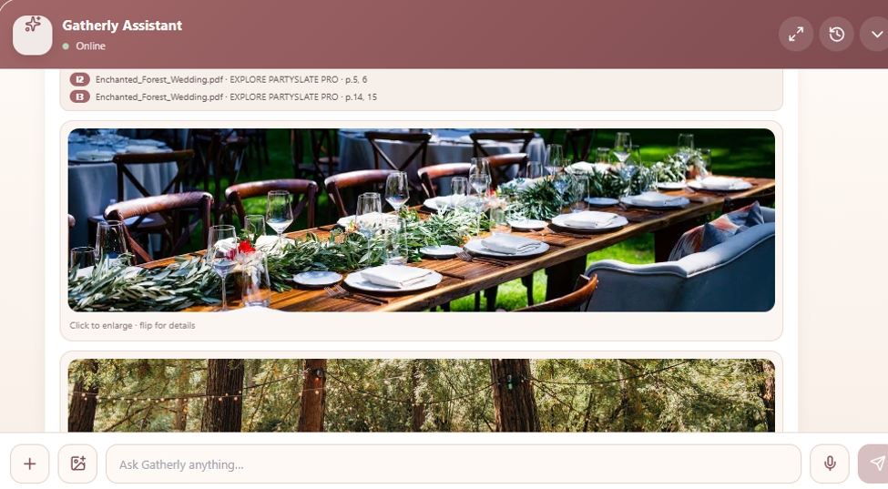
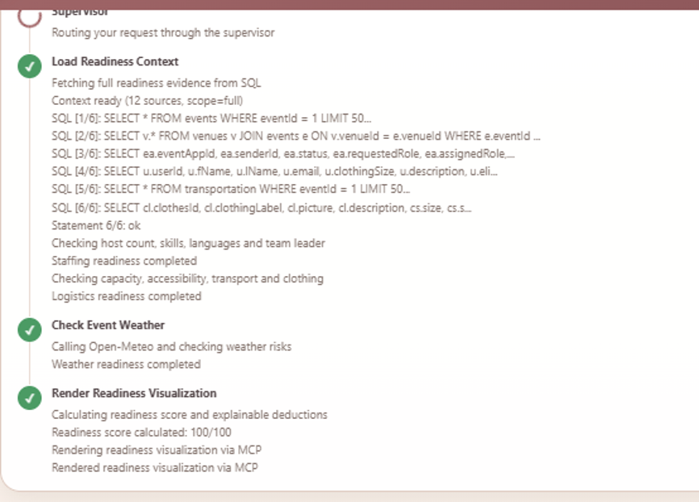
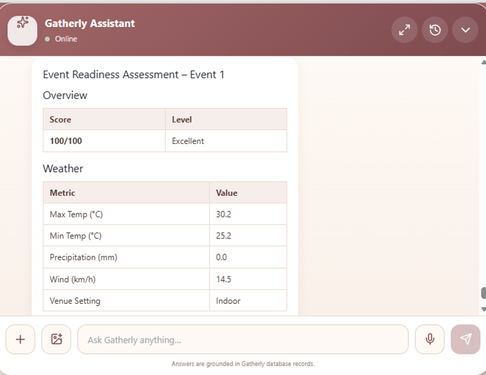
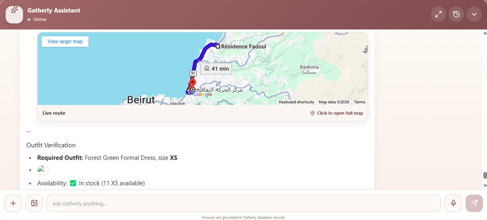
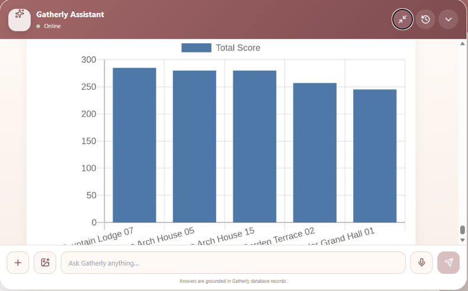
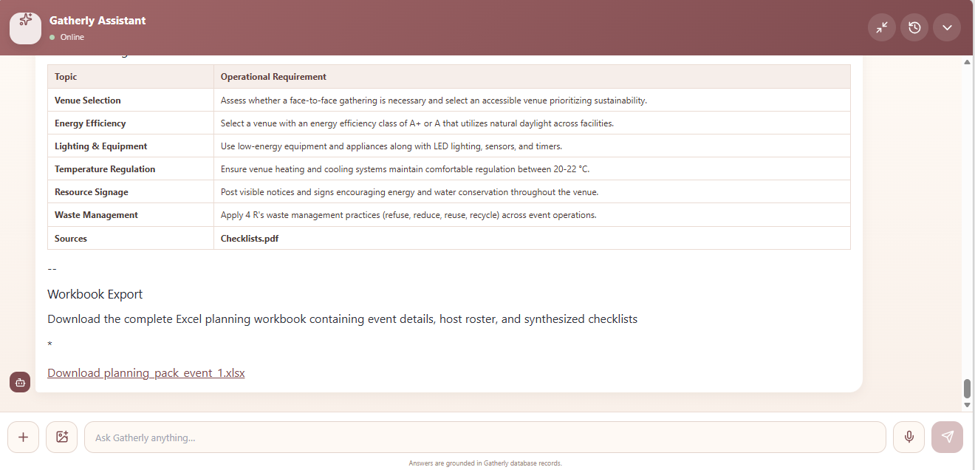
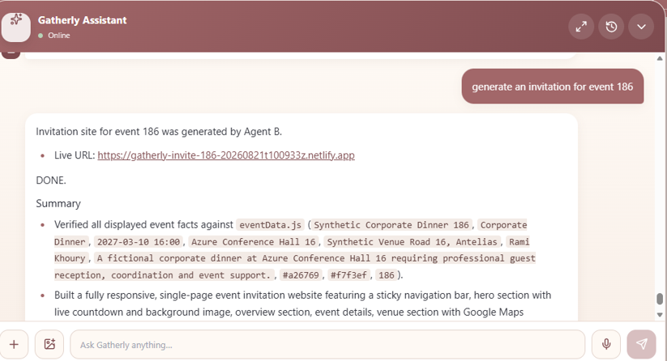

# Gatherly - AI-Powered Event Management System

Gatherly is a full-stack event management platform enhanced with machine learning, multimodal retrieval-augmented generation (RAG), and a multi-agent AI system.

The platform supports three user roles:

- **Clients** explore venues and plan events.
- **Hosts** receive assignments, routes, clothing requirements, and event briefings.
- **Administrators** monitor staffing, logistics, event readiness, and post-event reports.

A LangGraph supervisor analyzes each request and routes it to the appropriate specialist agent or tool.

## Key Features

- Multi-agent orchestration with specialized client, host, and admin agents
- Multilingual text and image RAG for event-planning documents
- Hybrid retrieval combining dense embeddings, lexical search, and reranking
- DistilBERT event-issue classifier for post-event debriefs
- AI-generated invitation websites with optional Netlify deployment
- Natural-language access to operational data through SQL agents
- Weather, route-planning, and visualization tools exposed through MCP
- Input and output guardrails for safer agent interactions
- Source-aware answers with document pages and related images
- Voice interface powered by Whisper
- Role-based authentication and event-management workflows

## Evaluation Results

The system was evaluated using saved retrieval, generation, routing, and guardrail test cases.

| Area | Metric | Result |
|---|---|---:|
| Text retrieval | Recall@5 | **94.9%** |
| Text retrieval | MRR@5 | **83.2%** |
| Text retrieval | Document Recall@5 | **100%** |
| Image retrieval | Recall@1 | **91.7%** |
| Generation | Faithfulness | **94.3%** |
| Generation | Correctness | **89.3%** |
| Generation | Relevance | **97.5%** |
| Agent routing | Routing accuracy | **93.3%** |
| Agent evaluation | Passed cases | **37/39 (94.9%)** |

Text retrieval was evaluated on 175 questions, image retrieval on 108 questions, and answer generation on 61 questions across English, Arabic, and French.

Detailed methodology and results are available in [`EVALUATION.md`](EVALUATION.md).

## Architecture



Agent A validates and routes each request to the appropriate specialist. Only the Invitation Site Agent delegates to Agent B, which generates, builds, and optionally deploys the invitation website.


## AI & Machine Learning Components

### Multimodal RAG

#### 1. Visual Style Agent - Search by Image



The user uploads an inspiration image. The Visual Style Agent uses a vision-language model to describe it, searches for visually related document content, and generates a grounded style analysis with citations.

#### 2. RAG Agent - Search for Images



The user asks a text question requesting visual examples. The RAG Agent searches the indexed collection for relevant images and returns them with their source file, page, and section metadata.

The RAG pipeline processes event-planning documents and their images through:

1. PDF text and image extraction
2. Semantic chunking and metadata enrichment
3. Multilingual embedding generation
4. Qdrant vector indexing
5. Hybrid dense and lexical retrieval
6. Cross-encoder reranking
7. Text or visual retrieval routing
8. Grounded answer generation with source attribution

The pipeline uses:

- `BAAI/bge-m3` for multilingual text embeddings
- `intfloat/multilingual-e5-base` for image-context retrieval
- `cross-encoder/mmarco-mMiniLMv2-L12-H384-v1` for reranking
- Qdrant for vector storage
- Gemini and OpenAI-compatible local model endpoints for routing and generation

The repository includes notebooks covering extraction, chunking, embeddings, retrieval experiments, image-context processing, and generation evaluation.

### Multi-Agent System

#### 3. Event Readiness Agent - Readiness Workflow



The live execution trace shows the supervisor routing the request to the Event Readiness Agent, which loads SQL context, checks weather conditions, calculates an explainable score, and renders a visualization through MCP.



The final answer presents the readiness score and the evidence used to produce it, including weather, staffing, and logistics.

#### 4. Event Debrief Agent - Issue Classification

The Event Debrief Agent uses a fine-tuned DistilBERT classifier to categorize team-leader feedback as `all_clear`, `clothing`, `staffing`, `transport`, `venue`, or `weather`. It then compares the predicted issue with recorded event data to produce a grounded post-event analysis.

The classifier training pipeline uses a stratified train/evaluation split, dynamic padding, macro-F1 evaluation, and best-checkpoint selection. The trained model is served through a dedicated FastAPI inference endpoint.

#### 5. Host Event Briefing Agent - Route Planning



The Host Event Briefing Agent calculates the host's departure and arrival times using the event schedule and OSRM route data, then returns the route through an interactive Google Maps view.

#### 6. Client Event Explorer Agent - Venue Comparison



The Client Event Explorer Agent compares eligible venues for a client's event and visualizes their combined suitability, weather, and route scores to support the final recommendation.

#### 7. Event Ops Workbook Agent - Planning Export



The Event Ops Workbook Agent combines event records with retrieved operational guidance and exports a structured Excel workbook containing event details, the host roster, and planning checklists.

#### 8. Agent B - Invitation Generation



The Invitation Site Agent in Agent A delegates the request to Agent B, which generates a React invitation website, validates its event data, and optionally deploys it to Netlify.

#### Agent A specialists

- **Supervisor Agent:** Interprets each request, creates a task plan, and routes it to the appropriate specialist.
- **SQL Agent:** Answers questions about events, venues, users, applications, clothing, and transportation using grounded MySQL data.
- **RAG Agent:** Retrieves relevant text or images from the document collection and generates answers with source attribution.
- **Visual Style Agent:** Analyzes an uploaded inspiration image and retrieves visually related wedding themes and decor guidance.
- **Client Event Explorer Agent:** Ranks venue options for a client's event using suitability, weather, distance, and route information.
- **Host Event Briefing Agent:** Builds a personalized host briefing with assignments, arrival time, weather, route, outfit, team, and timeline details.
- **Event Readiness Agent:** Evaluates staffing, weather, venue, transportation, and clothing readiness for an upcoming event.
- **Event Debrief Agent:** Classifies post-event feedback and compares the reported issue with recorded operational data.
- **Event Ops Workbook Agent:** Combines event data with retrieved planning guidance and exports a structured planning workbook.
- **Invitation Site Agent:** Collects the event context and delegates invitation website generation and deployment to Agent B.
- **General Agent:** Handles greetings and general questions that do not require Gatherly data or a specialist workflow.
- **Input and Output Guards:** Block unsafe requests and validate responses before they are returned to the user.


## Technology Stack

| Area | Technologies |
|---|---|
| Machine Learning | PyTorch, Hugging Face Transformers, Sentence Transformers, scikit-learn |
| Agent Orchestration | LangGraph, LangChain, Google ADK |
| Retrieval | Qdrant, dense embeddings, TF-IDF, cross-encoder reranking |
| AI Models | Gemini, Ollama, DistilBERT, BGE-M3, multilingual E5 |
| APIs | FastAPI, Express.js, MCP |
| Frontend | React, Bootstrap, Tailwind CSS, Leaflet |
| Database | MySQL |
| Infrastructure | Docker Compose, Nginx, Netlify |
| Evaluation | Recall@K, MRR, NDCG, macro-F1, LLM-as-a-judge |

## Services

| Service | Responsibility | Port |
|---|---|---:|
| `services/frontend` | React user interface | 3000 |
| `services/backend` | Authentication, product API, and chat proxy | 5050 |
| `services/agent-a` | LangGraph supervisor and specialist agents | 8001 |
| `services/agent-b` | Invitation website generation | 8002 |
| `services/gatherly_rag` | Multimodal document RAG | 8003 |
| `services/voice-demo` | Whisper voice interface | 8005 |
| `services/mcp-server` | Weather, routing, and visualization tools | 8000 |
| `services/classifier` | DistilBERT event-issue classification | 8006 |

## Repository Structure

```text
.
├── EVALUATION.md
├── services/
│   ├── agent-a/          # LangGraph supervisor and specialists
│   ├── agent-b/          # Invitation-generation agent
│   ├── backend/          # Express and MySQL API
│   ├── classifier/       # DistilBERT training and inference
│   ├── frontend/         # React application
│   ├── gatherly_rag/     # Multimodal RAG pipeline and experiments
│   ├── mcp-server/       # External tools exposed through MCP
│   └── voice-demo/       # Speech-to-text interface
├── docker-compose.yml
├── .env.example
└── README.md
```

## Getting Started

### Prerequisites

- Docker and Docker Compose
- MySQL 8
- An API key for the configured language model provider
- Ollama if using a local OpenAI-compatible model endpoint

### Configuration

Copy the environment template:

```bash
cp .env.example .env
```

Configure the required values in `.env`, including:

```env
DB_HOST=
DB_USER=
DB_PASS=
DB_NAME=Gatherly
JWT_SECRET=

GEMINI_API_KEY=
OPENROUTER_API_KEY=
GROQ_API_KEY=

MCP_API_TOKEN=
QDRANT_URL=
RAG_API_URL=
AGENT_B_URL=
```

Do not commit `.env` or any credentials to version control.

### Run with Docker

Make sure MySQL is running on the host, then start the application:

```bash
docker compose up --build
```

Open the frontend at `http://localhost:3000`.

Qdrant is available at `http://localhost:6333`.

To use the optional containerized MySQL service:

```bash
docker compose --profile docker-mysql up --build
```

## Local Development

Start the services in separate terminals.

### MCP Server

```bash
cd services/mcp-server
pip install -r requirements.txt
python server.py
```

### Agent System

```bash
cd services/agent-a
pip install -r requirements.txt
uvicorn api.server:app --reload --port 8001
```

### Backend

```bash
cd services/backend
npm install
npm start
```

### Frontend

```bash
cd services/frontend
npm install
npm start
```

### Event-Issue Classifier

The classifier uses the trained checkpoint at `services/classifier/models/event-issue`. Install its dependencies and start the inference API:

```bash
cd services/classifier
pip install -r requirements.txt
uvicorn app:app --reload --port 8006
```

The saved checkpoint is excluded from Git because of its size. The training script and labeled dataset are included for reproducibility; run `python train.py` only when rebuilding the checkpoint from scratch.

Example request:

```bash
curl -X POST http://localhost:8006/classify \
  -H "Content-Type: application/json" \
  -d "{\"text\":\"Two hosts arrived late because their transportation was delayed.\"}"
```

