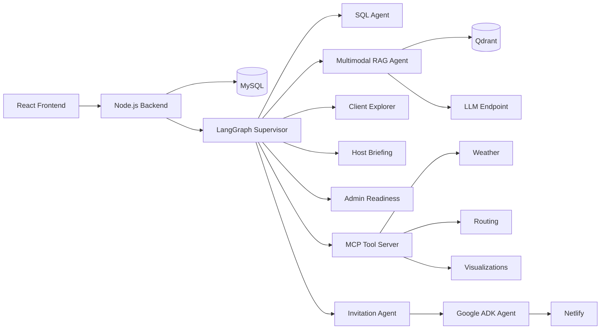

# Gatherly - AI-Powered Event Management System

Gatherly is a full-stack event management platform enhanced with machine learning, multimodal retrieval-augmented generation (RAG), and a multi-agent AI system.

The platform supports three user roles:

- **Clients** explore venues and plan events.
- **Hosts** receive assignments, routes, clothing requirements, and event briefings.
- **Administrators** monitor staffing, logistics, event readiness, and post-event reports.

A LangGraph supervisor analyzes each request and routes it to the appropriate specialist agent or tool.

## Key Features

- Multi-agent orchestration with specialized client, host, and admin agents
- Multilingual text and image RAG for event-planning documents
- Hybrid retrieval combining dense embeddings, lexical search, and reranking
- DistilBERT event-issue classifier for post-event debriefs
- AI-generated invitation websites with optional Netlify deployment
- Natural-language access to operational data through SQL agents
- Weather, route-planning, and visualization tools exposed through MCP
- Input and output guardrails for safer agent interactions
- Source-aware answers with document pages and related images
- Voice interface powered by Whisper
- Role-based authentication and event-management workflows

## Machine Learning Highlights

### Multimodal RAG

The RAG pipeline processes event-planning documents and their images through:

1. PDF text and image extraction
2. Semantic chunking and metadata enrichment
3. Multilingual embedding generation
4. Qdrant vector indexing
5. Hybrid dense and lexical retrieval
6. Cross-encoder reranking
7. Text or visual retrieval routing
8. Grounded answer generation with source attribution

The pipeline uses:

- `BAAI/bge-m3` for multilingual text embeddings
- `intfloat/multilingual-e5-base` for image-context retrieval
- `cross-encoder/mmarco-mMiniLMv2-L12-H384-v1` for reranking
- Qdrant for vector storage
- Gemini and OpenAI-compatible local model endpoints for routing and generation

The repository includes notebooks covering extraction, chunking, embeddings, retrieval experiments, image-context processing, and generation evaluation.

### Event-Issue Classification

A DistilBERT sequence classifier categorizes team-leader debriefs into six operational classes:

- `all_clear`
- `clothing`
- `staffing`
- `transport`
- `venue`
- `weather`

The training pipeline includes stratified train/evaluation splitting, dynamic padding, macro-F1 evaluation, best-checkpoint selection, and FastAPI inference.

### Multi-Agent System

The LangGraph agent system includes:

- Supervisor and intent-routing agent
- SQL data agent
- Document RAG agent
- Visual-style agent
- Client event explorer
- Host event-briefing agent
- Admin event-readiness agent
- Post-event debrief agent
- Invitation-generation agent
- Input and output safety guards

Specialists can coordinate across database queries, document retrieval, weather services, route planning, visualization tools, and invitation generation.

## Evaluation Results

The system was evaluated using saved retrieval, generation, routing, and guardrail test cases.

| Area | Metric | Result |
|---|---|---:|
| Text retrieval | Recall@5 | **94.9%** |
| Text retrieval | MRR@5 | **83.2%** |
| Text retrieval | Document Recall@5 | **100%** |
| Image retrieval | Recall@1 | **91.7%** |
| Generation | Faithfulness | **94.3%** |
| Generation | Correctness | **89.3%** |
| Generation | Relevance | **97.5%** |
| Agent routing | Routing accuracy | **93.3%** |
| Agent evaluation | Passed cases | **37/39 (94.9%)** |

Text retrieval was evaluated on 175 questions, image retrieval on 108 questions, and answer generation on 61 questions across English, Arabic, and French.

Detailed methodology and results are available in [`docs/EVALUATION.md`](docs/EVALUATION.md).

## Architecture



## Technology Stack

| Area | Technologies |
|---|---|
| Machine Learning | PyTorch, Hugging Face Transformers, Sentence Transformers, scikit-learn |
| Agent Orchestration | LangGraph, LangChain, Google ADK |
| Retrieval | Qdrant, dense embeddings, TF-IDF, cross-encoder reranking |
| AI Models | Gemini, Ollama, DistilBERT, BGE-M3, multilingual E5 |
| APIs | FastAPI, Express.js, MCP |
| Frontend | React, Bootstrap, Tailwind CSS, Leaflet |
| Database | MySQL |
| Infrastructure | Docker Compose, Nginx, Netlify |
| Evaluation | Recall@K, MRR, NDCG, macro-F1, LLM-as-a-judge |

## Services

| Service | Responsibility | Port |
|---|---|---:|
| `services/frontend` | React user interface | 3000 |
| `services/backend` | Authentication, product API, and chat proxy | 5050 |
| `services/agent-a` | LangGraph supervisor and specialist agents | 8001 |
| `services/agent-b` | Invitation website generation | 8002 |
| `services/gatherly_rag` | Multimodal document RAG | 8003 |
| `services/voice-demo` | Whisper voice interface | 8005 |
| `services/mcp-server` | Weather, routing, and visualization tools | 8000 |
| `services/classifier` | DistilBERT event-issue classification | 8006 |

## Repository Structure

```text
.
├── docs/
│   └── EVALUATION.md
├── services/
│   ├── agent-a/          # LangGraph supervisor and specialists
│   ├── agent-b/          # Invitation-generation agent
│   ├── backend/          # Express and MySQL API
│   ├── classifier/       # DistilBERT training and inference
│   ├── frontend/         # React application
│   ├── gatherly_rag/     # Multimodal RAG pipeline and experiments
│   ├── mcp-server/       # External tools exposed through MCP
│   └── voice-demo/       # Speech-to-text interface
├── docker-compose.yml
├── .env.example
└── README.md
```

## Getting Started

### Prerequisites

- Docker and Docker Compose
- MySQL 8
- An API key for the configured language model provider
- Ollama if using a local OpenAI-compatible model endpoint

### Configuration

Copy the environment template:

```bash
cp .env.example .env
```

Configure the required values in `.env`, including:

```env
DB_HOST=
DB_USER=
DB_PASS=
DB_NAME=Gatherly
JWT_SECRET=

GEMINI_API_KEY=
OPENROUTER_API_KEY=
GROQ_API_KEY=

MCP_API_TOKEN=
QDRANT_URL=
RAG_API_URL=
AGENT_B_URL=
```

Do not commit `.env` or any credentials to version control.

### Run with Docker

Make sure MySQL is running on the host, then start the application:

```bash
docker compose up --build
```

Open the frontend at `http://localhost:3000`.

Qdrant is available at `http://localhost:6333`.

To use the optional containerized MySQL service:

```bash
docker compose --profile docker-mysql up --build
```

## Local Development

Start the services in separate terminals.

### MCP Server

```bash
cd services/mcp-server
pip install -r requirements.txt
python server.py
```

### Agent System

```bash
cd services/agent-a
pip install -r requirements.txt
uvicorn api.server:app --reload --port 8001
```

### Backend

```bash
cd services/backend
npm install
npm start
```

### Frontend

```bash
cd services/frontend
npm install
npm start
```

### Event-Issue Classifier

Train the DistilBERT model:

```bash
cd services/classifier
pip install -r requirements.txt
python train.py
```

Start its inference API:

```bash
uvicorn app:app --reload --port 8006
```

Example request:

```bash
curl -X POST http://localhost:8006/classify \
  -H "Content-Type: application/json" \
  -d "{\"text\":\"Two hosts arrived late because their transportation was delayed.\"}"
```

